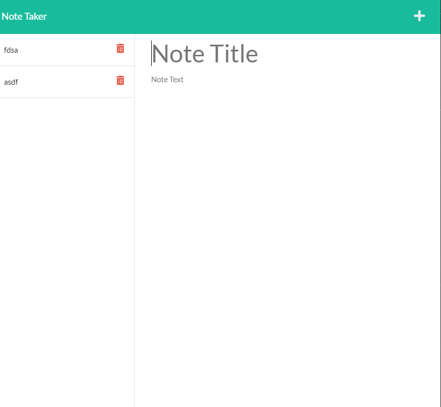

# note-taker-hw 
Note taker homework saving notes.

##
* created server and port 3001 along with routes.
* fixed my server.js in order to add notes to the website.
* deployed webage correctly to HEROKU

## Links
- [Github](https://github.com/LilAdobe/note-take-hw)
- [Heroku](https://floating-spire-69545.herokuapp.com/)

## screenshot

